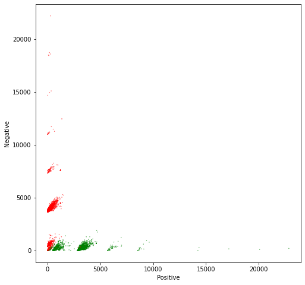
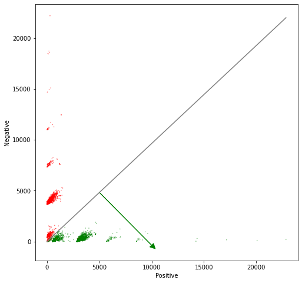

# Visualizing tweets and the Logistic Regression model

**Objectives:** Visualize and interpret the logistic regression model

**Steps:**
* Plot tweets in a scatter plot using their positive and negative sums.
* Plot the output of the logistic regression model in the same plot as a solid line

## Import the required libraries

We will be using [*NLTK*](http://www.nltk.org/howto/twitter.html), an opensource NLP library, for collecting, handling, and processing Twitter data. In this lab, we will use the example dataset that comes alongside with NLTK. This dataset has been manually annotated and serves to establish baselines for models quickly. 

So, to start, let's import the required libraries. 


```python
import nltk                         # NLP toolbox
from os import getcwd
import pandas as pd                 # Library for Dataframes 
from nltk.corpus import twitter_samples 
import matplotlib.pyplot as plt     # Library for visualization
import numpy as np                  # Library for math functions

from utils import process_tweet, build_freqs # Our functions for NLP

nltk.download('twitter_samples')
```


```python
import nltk 
from os import getcwd
import pandas as pd
from nltk.corpus import twitter_samples
import matplotlib.pyplot as plt
import numpy as np

from utils import process_tweet, build_freqs

nltk.download('twitter_samples')
```

    [nltk_data] Downloading package twitter_samples to
    [nltk_data]     /home/jovyan/nltk_data...
    [nltk_data]   Package twitter_samples is already up-to-date!


    True


## Load the NLTK sample dataset

To complete this lab, you need the sample dataset of the previous lab. Here, we assume the files are already available, and we only need to load into Python lists.


```python
# select the set of positive and negative tweets
all_positive_tweets = twitter_samples.strings('positive_tweets.json')
all_negative_tweets = twitter_samples.strings('negative_tweets.json')

tweets = all_positive_tweets + all_negative_tweets ## Concatenate the lists. 
labels = np.append(np.ones((len(all_positive_tweets),1)), np.zeros((len(all_negative_tweets),1)), axis = 0)

# split the data into two pieces, one for training and one for testing (validation set) 
train_pos  = all_positive_tweets[:4000]
train_neg  = all_negative_tweets[:4000]

train_x = train_pos + train_neg 

print("Number of tweets: ", len(train_x))
```

    Number of tweets:  8000


```python

```

# Load the extracted features

Part of this week's assignment is the creation of the numerical features needed for the Logistic regression model. In order not to interfere with it, we have previously calculated and stored these features in a CSV file for the entire training set.

So, please load these features created for the tweets sample. 


```python
data = pd.read_csv('./data/logistic_features.csv'); # Load a 3 columns csv file using pandas function
data.head(10) # Print the first 10 data entries
```


```python

```


<div>
<style scoped>
    .dataframe tbody tr th:only-of-type {
        vertical-align: middle;
    }

    .dataframe tbody tr th {
        vertical-align: top;
    }

    .dataframe thead th {
        text-align: right;
    }
</style>
<table border="1" class="dataframe">
  <thead>
    <tr style="text-align: right;">
      <th></th>
      <th>bias</th>
      <th>positive</th>
      <th>negative</th>
      <th>sentiment</th>
    </tr>
  </thead>
  <tbody>
    <tr>
      <th>0</th>
      <td>1.0</td>
      <td>3020.0</td>
      <td>61.0</td>
      <td>1.0</td>
    </tr>
    <tr>
      <th>1</th>
      <td>1.0</td>
      <td>3573.0</td>
      <td>444.0</td>
      <td>1.0</td>
    </tr>
    <tr>
      <th>2</th>
      <td>1.0</td>
      <td>3005.0</td>
      <td>115.0</td>
      <td>1.0</td>
    </tr>
    <tr>
      <th>3</th>
      <td>1.0</td>
      <td>2862.0</td>
      <td>4.0</td>
      <td>1.0</td>
    </tr>
    <tr>
      <th>4</th>
      <td>1.0</td>
      <td>3119.0</td>
      <td>225.0</td>
      <td>1.0</td>
    </tr>
    <tr>
      <th>5</th>
      <td>1.0</td>
      <td>2955.0</td>
      <td>119.0</td>
      <td>1.0</td>
    </tr>
    <tr>
      <th>6</th>
      <td>1.0</td>
      <td>3934.0</td>
      <td>538.0</td>
      <td>1.0</td>
    </tr>
    <tr>
      <th>7</th>
      <td>1.0</td>
      <td>3162.0</td>
      <td>276.0</td>
      <td>1.0</td>
    </tr>
    <tr>
      <th>8</th>
      <td>1.0</td>
      <td>628.0</td>
      <td>189.0</td>
      <td>1.0</td>
    </tr>
    <tr>
      <th>9</th>
      <td>1.0</td>
      <td>264.0</td>
      <td>112.0</td>
      <td>1.0</td>
    </tr>
  </tbody>
</table>
</div>


Now let us get rid of the data frame to keep only Numpy arrays.


```python
# Each feature is labeled as bias, positive and negative
X = data[['bias', 'positive', 'negative']].values # Get only the numerical values of the dataframe
Y = data['sentiment'].values; # Put in Y the corresponding labels or sentiments

print(X.shape) # Print the shape of the X part
print(X) # Print some rows of X
```

    (8000, 3)
    [[1.000e+00 3.020e+03 6.100e+01]
     [1.000e+00 3.573e+03 4.440e+02]
     [1.000e+00 3.005e+03 1.150e+02]
     ...
     [1.000e+00 1.440e+02 7.830e+02]
     [1.000e+00 2.050e+02 3.890e+03]
     [1.000e+00 1.890e+02 3.974e+03]]


```python

```

    (8000, 3)


## Load a pretrained Logistic Regression model

In the same way, as part of this week's assignment, a Logistic regression model must be trained. The next cell contains the resulting model from such training. Notice that a list of 3 numeric values represents the whole model, that we have called _theta_ $\theta$.


```python
theta = [6.03518871e-08, 5.38184972e-04, -5.58300168e-04]
```

## Plot the samples in a scatter plot

The vector theta represents a plane that split our feature space into two parts. Samples located over that plane are considered positive, and samples located under that plane are considered negative. Remember that we have a 3D feature space, i.e., each tweet is represented as a vector comprised of three values: `[bias, positive_sum, negative_sum]`, always having `bias = 1`. 

If we ignore the bias term, we can plot each tweet in a cartesian plane, using `positive_sum` and `negative_sum`. In the cell below, we do precisely this. Additionally, we color each tweet, depending on its class. Positive tweets will be green and negative tweets will be red.


```python
# Plot the samples using columns 1 and 2 of the matrix
fig, ax = plt.subplots(figsize = (8, 8))

colors = ['red', 'green']

# Color based on the sentiment Y
ax.scatter(X[:,1], X[:,2], c=[colors[int(k)] for k in Y], s = 0.1)  # Plot a dot for each pair of words
plt.xlabel("Positive")
plt.ylabel("Negative")
```


    Text(0, 0.5, 'Negative')





```python

```

From the plot, it is evident that the features that we have chosen to represent tweets as numerical vectors allow an almost perfect separation between positive and negative tweets. So you can expect a very high accuracy for this model! 

## Plot the model alongside the data

We will draw a gray line to show the cutoff between the positive and negative regions. In other words, the gray line marks the line where $$ z = \theta * x = 0.$$
To draw this line, we have to solve the above equation in terms of one of the independent variables.

$$ z = \theta * x = 0$$
$$ x = [1, pos, neg] $$
$$ z(\theta, x) = \theta_0+ \theta_1 * pos + \theta_2 * neg = 0 $$
$$ neg = (-\theta_0 - \theta_1 * pos) / \theta_2 $$

The red and green lines that point in the direction of the corresponding sentiment are calculated using a perpendicular line to the separation line calculated in the previous equations (neg function). It must point in the same direction as the derivative of the Logit function, but the magnitude may differ. It is only for a visual representation of the model. 

$$direction = pos * \theta_2 / \theta_1$$


```python
# Equation for the separation plane
# It give a value in the negative axe as a function of a positive value
# f(pos, neg, W) = w0 + w1 * pos + w2 * neg = 0
# s(pos, W) = (-w0 - w1 * pos) / w2
def neg(theta, pos):
    return (-theta[0] - pos * theta[1]) / theta[2]

# Equation for the direction of the sentiments change
# We don't care about the magnitude of the change. We are only interested 
# in the direction. So this direction is just a perpendicular function to the 
# separation plane
# df(pos, W) = pos * w2 / w1
def direction(theta, pos):
    return    pos * theta[2] / theta[1]
```


```python
def neg(theta, pos):
    return (-theta[0] - pos * theta[1]) / theta[2]

def direction(theta, pos):
    return pos * theta[2] / theta[1]
```

The green line in the chart points in the direction where z > 0 and the red line points in the direction where z < 0. The direction of these lines are given by the weights $\theta_1$ and $\theta_2$


```python
# Plot the samples using columns 1 and 2 of the matrix
fig, ax = plt.subplots(figsize = (8, 8))

colors = ['red', 'green']

# Color base on the sentiment Y
ax.scatter(X[:,1], X[:,2], c=[colors[int(k)] for k in Y], s = 0.1)  # Plot a dot for each pair of words
plt.xlabel("Positive")
plt.ylabel("Negative")

# Now lets represent the logistic regression model in this chart. 
maxpos = np.max(X[:,1])

offset = 5000 # The pos value for the direction vectors origin

# Plot a gray line that divides the 2 areas.
ax.plot([0,  maxpos], [neg(theta, 0),   neg(theta, maxpos)], color = 'gray') 

# Plot a green line pointing to the positive direction
ax.arrow(offset, neg(theta, offset), offset, direction(theta, offset), head_width=500, head_length=500, fc='g', ec='g')
# Plot a red line pointing to the negative direction
ax.arrow(offset, neg(theta, offset), -offset, -direction(theta, offset), head_width=500, head_length=500, fc='r', ec='r')

plt.show()
```


```python
fig, ax = plt.subplots(figsize = (8, 8))

colors = ['red', 'green']

# Color base on the sentiment Y
ax.scatter(X[:,1], X[:,2], c=[colors[int(k)] for k in Y], s = 0.1)  # Plot a dot for each pair of words
plt.xlabel("Positive")
plt.ylabel("Negative")

maxpos = np.max(X[:,1])
maxpos

offset = 5000
ax.plot([0, maxpos], [neg(theta, 0), neg(theta, maxpos)], color='gray')
ax.arrow(offset, neg(theta, offset), offset, direction(theta, offset), head_width=500, head_length=500, fc='g', ec='g')
ax.arrow(offset, neg(theta, offset), -offset, -direction(theta, offset), head)

```


    <matplotlib.patches.FancyArrow at 0x72b0fe54ff90>





**Note that more critical than the Logistic regression itself, are the features extracted from tweets that allow getting the right results in this exercise.**

That is all, folks. Hopefully, now you understand better what the Logistic regression model represents, and why it works that well for this specific problem. 
